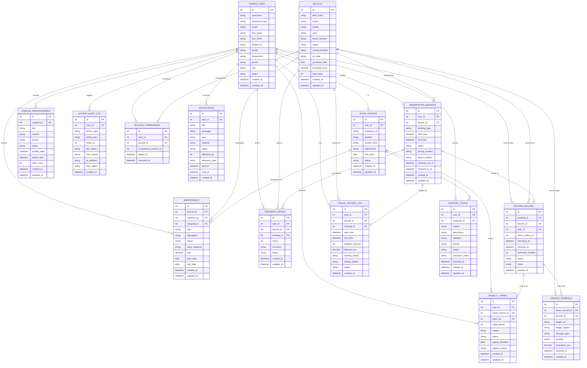

# Database Schema — ระบบจองยืมจักรยานออนไลน์ (Online Bicycle Rental Reservation System)

## 🗄️ ER Diagram

---

## 📋 คำอธิบาย Database Schema

### 🎯 ภาพรวม

Database Schema นี้แปลงมาจาก Class Diagram ของระบบจองยืมจักรยานออนไลน์ ประกอบด้วย **15 ตาราง** โดย methods ทั้งหมดในคลาสจะถูกนำไปทำเป็น business logic ในระดับ Application Layer (Django / FastAPI) ไม่ได้เก็บไว้ใน Database

### 🔑 หลักการแปลง Class → Table

| Class concept | Database concept |
|---|---|
| Attribute (field) | Column |
| `+int id` | `id` (Primary Key, auto-increment) |
| Foreign key แบบ `xxx_id` | Column ชนิด `int` พร้อม `FK` constraint |
| Method (`+method()`) | ไม่ถูกแปลงเป็น column — ใช้เป็น business logic ที่ layer แอปพลิเคชัน |
| `string` ที่เป็นชุดค่าคงที่ (เช่น `role`, `status`) | แนะนำให้ทำเป็น `ENUM` หรือ lookup table แทน `VARCHAR` เปิดกว้าง |

### 🗂️ ตารางและ Foreign Key หลัก

| ตาราง | Primary Key | Foreign Key ที่อ้างถึง |
|---|---|---|
| `unified_user` | id | – |
| `bicycle` | id | – |
| `maintenance` | id | bicycle_id → bicycle, reported_by/assigned_to → unified_user |
| `staff_officer` | id | user_id → unified_user |
| `campus_announcement` | id | created_by → unified_user |
| `system_audit_log` | id | user_id → unified_user |
| `bicycle_comparison` | id | user_id → unified_user, bicycle_id → bicycle |
| `notification` | id | user_id → unified_user |
| `feedback_rating` | id | user_id → unified_user, bicycle_id → bicycle, booking_id → reservation_booking |
| `return_record` | id | booking_id → reservation_booking, bicycle_id → bicycle, user_id → unified_user |
| `damage_evidence` | id | return_record_id → return_record, bicycle_id → bicycle |
| `penalty_strike` | id | user_id → unified_user, return_record_id → return_record, given_by → unified_user (staff) |
| `reservation_booking` | id | user_id → unified_user, bicycle_id → bicycle |
| `usage_history_log` | id | user_id → unified_user, bicycle_id → bicycle, booking_id → reservation_booking |
| `support_ticket` | id | user_id → unified_user, assigned_to → unified_user (staff) |

### ⚠️ ข้อควรพิจารณาเพิ่มเติม

1. **ENUM fields** — ควรกำหนดค่าที่แน่นอนตามที่ระบุใน Class Diagram เดิม เช่น:
   - `unified_user.role` → `student`, `staff`, `officer`
   - `bicycle.status` → `available`, `in_use`, `under_maintenance`, `retired`
   - `reservation_booking.status` → `pending`, `confirmed`, `in_progress`, `completed`, `cancelled`, `no_show`

2. **`staff_officer.user_id`** ควรมี `UNIQUE constraint` เพราะเป็นความสัมพันธ์ 1:0..1 กับ `unified_user`

3. **`return_record.return_station_id`** และ `usage_history_log.starting_station` / `ending_station` — ในไดอะแกรมเดิมยังเป็น string/int เปล่า ๆ ถ้ามีตาราง Station แยกในระบบจริง ควรทำเป็น FK ไปยังตาราง `station` แทน

4. **Cross-service tables (Monolith vs FastAPI)** — เนื่องจากระบบแบ่งเป็น Django Monolith และ FastAPI/React แยกกัน หากใช้ database คนละตัว ควรพิจารณาว่า field ที่อ้างข้ามฝั่ง (เช่น `user_id`, `bicycle_id` ที่ FastAPI service ต้องอ้างถึง) จะ sync กันอย่างไร (เช่น ผ่าน API แทน FK ตรง หรือใช้ shared DB)
