# Database Schema v2 — ระบบจองยืมจักรยานออนไลน์ (BikeA)

> อัปเดตจาก Schema เดิม ตาม **ข้อควรพิจารณาเพิ่มเติม** ที่ระบุไว้ก่อนหน้า:
> 1. เพิ่ม `ENUM` type จริงสำหรับ field ที่เป็นชุดค่าคงที่ (แทน `VARCHAR` เปิดกว้าง)
> 2. เพิ่ม `UNIQUE` constraint ที่ `staff_officer.user_id`
> 3. ~~เพิ่มตาราง `station` แยก~~ — **ตัดออก** (ไม่จำเป็นสำหรับ mock/prototype) เก็บ location เป็น string เหมือนเดิม
> 4. เปลี่ยนตาราง `penalty_strike` (ของเอกพล) เป็น **`favorite`** (Favorite Bicycles & Stations) ตาม scope งานใหม่
> 5. Cross-service sync ระหว่าง Monolith (Django) กับ Client-Server (FastAPI) → ใช้ **Shared Database** (ทั้งสองฝั่งต่อ Postgres instance เดียวกัน, FK ใช้งานได้ปกติ)

---

## 🔤 ENUM Types

```sql
CREATE TYPE user_role        AS ENUM ('student', 'staff', 'officer');
CREATE TYPE user_status      AS ENUM ('active', 'inactive', 'suspended');
CREATE TYPE bicycle_status   AS ENUM ('available', 'in_use', 'under_maintenance', 'retired');
CREATE TYPE maintenance_type AS ENUM ('repair', 'routine_check', 'part_replacement');
CREATE TYPE maintenance_status AS ENUM ('pending', 'in_progress', 'completed', 'cancelled');
CREATE TYPE announcement_priority AS ENUM ('low', 'normal', 'high', 'urgent');
CREATE TYPE announcement_status   AS ENUM ('draft', 'published', 'archived');
CREATE TYPE booking_type    AS ENUM ('advance_reservation', 'walk_in');
CREATE TYPE booking_status  AS ENUM ('pending', 'confirmed', 'in_progress', 'completed', 'cancelled', 'no_show');
CREATE TYPE return_status   AS ENUM ('normal', 'late', 'damaged', 'lost');
CREATE TYPE damage_severity AS ENUM ('minor', 'moderate', 'severe');
CREATE TYPE favorite_target_type AS ENUM ('bicycle', 'station');
CREATE TYPE notification_type    AS ENUM ('booking', 'return', 'penalty', 'system', 'promotion');
CREATE TYPE notification_channel AS ENUM ('in_app', 'email', 'sms');
CREATE TYPE notification_status  AS ENUM ('pending', 'sent', 'read', 'failed');
CREATE TYPE feedback_status  AS ENUM ('visible', 'hidden', 'flagged');
CREATE TYPE ticket_category  AS ENUM ('bicycle_issue', 'account_issue', 'booking_issue', 'other');
CREATE TYPE ticket_priority  AS ENUM ('low', 'normal', 'high', 'urgent');
CREATE TYPE ticket_status    AS ENUM ('open', 'in_progress', 'resolved', 'closed', 'reopened');
```

---

## 🗄️ ER Diagram

```mermaid
erDiagram
    %% ==================== 1. นายปิยะพงษ์ ====================
    UNIFIED_USER {
        int id PK
        string username
        string password_hash
        string email
        string first_name
        string last_name
        string student_id
        string faculty
        string department
        string phone
        user_role role
        user_status status
        datetime created_at
        datetime updated_at
    }

    BICYCLE {
        int id PK
        string bike_code
        string brand
        string model
        string color
        string frame_number
        bicycle_status status
        string current_location
        string qr_code
        date purchase_date
        decimal purchase_price
        int total_rides
        datetime created_at
        datetime updated_at
    }

    MAINTENANCE {
        int id PK
        int bicycle_id FK
        int reported_by FK
        int assigned_to FK
        maintenance_type type
        string description
        maintenance_status status
        string parts_replaced
        decimal cost
        date start_date
        date end_date
        datetime created_at
        datetime updated_at
    }

    %% ==================== 2. นายวีรพันธ์ ====================
    STAFF_OFFICER {
        int id PK
        int user_id FK "UNIQUE"
        string employee_id
        string position
        string access_level
        string department
        date hire_date
        user_status status
        datetime created_at
        datetime updated_at
    }

    CAMPUS_ANNOUNCEMENT {
        int id PK
        int created_by FK
        string title
        string content
        announcement_priority priority
        announcement_status status
        datetime publish_date
        datetime expire_date
        int view_count
        datetime created_at
        datetime updated_at
    }

    SYSTEM_AUDIT_LOG {
        int id PK
        int user_id FK
        string action_type
        string entity_type
        int entity_id
        string old_values
        string new_values
        string ip_address
        string user_agent
        datetime created_at
    }

    %% ==================== 3. นายเอกพล ====================
    FAVORITE {
        int id PK
        int user_id FK
        favorite_target_type target_type
        int bicycle_id FK "nullable"
        string station_name "nullable"
        string nickname
        datetime created_at
        datetime updated_at
    }

    DAMAGE_EVIDENCE {
        int id PK
        int return_record_id FK
        int bicycle_id FK
        string image_url
        string image_caption
        string damage_type
        damage_severity severity
        decimal estimated_cost
        datetime reported_at
        datetime created_at
    }

    RETURN_RECORD {
        int id PK
        int booking_id FK
        int bicycle_id FK
        int user_id FK
        string return_location
        datetime borrowed_at
        datetime returned_at
        int odometer_reading
        return_status status
        string notes
        datetime created_at
    }

    %% ==================== 4. นางสาวณธิดา ====================
    BICYCLE_COMPARISON {
        int id PK
        int user_id FK
        int bicycle_id FK
        int comparison_session_id
        datetime added_at
        datetime removed_at
    }

    NOTIFICATION {
        int id PK
        int user_id FK
        string title
        string message
        notification_type type
        notification_channel channel
        notification_status status
        int reference_id
        string reference_type
        datetime sent_at
        datetime read_at
        datetime created_at
    }

    FEEDBACK_RATING {
        int id PK
        int user_id FK
        int bicycle_id FK
        int booking_id FK
        int rating
        string comment
        feedback_status status
        datetime created_at
        datetime updated_at
    }

    %% ==================== 5. นายชัยอนันต์ ====================
    RESERVATION_BOOKING {
        int id PK
        int user_id FK
        int bicycle_id FK
        booking_type booking_type
        datetime start_time
        datetime end_time
        booking_status status
        string pickup_location
        string return_location
        datetime checked_out_at
        datetime checked_in_at
        datetime created_at
        datetime updated_at
    }

    USAGE_HISTORY_LOG {
        int id PK
        int user_id FK
        int bicycle_id FK
        int booking_id FK
        datetime start_time
        datetime end_time
        int duration_minutes
        decimal distance_km
        string starting_station
        string ending_station
        string status
        datetime created_at
    }

    SUPPORT_TICKET {
        int id PK
        int user_id FK
        int assigned_to FK
        string subject
        string description
        ticket_category category
        ticket_priority priority
        ticket_status status
        string resolution_notes
        datetime resolved_at
        datetime created_at
        datetime updated_at
    }

    %% ==================== RELATIONSHIPS ====================
    UNIFIED_USER ||--o| STAFF_OFFICER : "is"
    UNIFIED_USER ||--o{ BICYCLE_COMPARISON : "compares"
    UNIFIED_USER ||--o{ NOTIFICATION : "receives"
    UNIFIED_USER ||--o{ FEEDBACK_RATING : "writes"
    UNIFIED_USER ||--o{ RETURN_RECORD : "returns bike"
    UNIFIED_USER ||--o{ FAVORITE : "saves"
    UNIFIED_USER ||--o{ RESERVATION_BOOKING : "makes"
    UNIFIED_USER ||--o{ USAGE_HISTORY_LOG : "has"
    UNIFIED_USER ||--o{ SUPPORT_TICKET : "creates"
    UNIFIED_USER ||--o{ CAMPUS_ANNOUNCEMENT : "creates"
    UNIFIED_USER ||--o{ SYSTEM_AUDIT_LOG : "triggers"
    UNIFIED_USER ||--o{ MAINTENANCE : "reports"

    BICYCLE ||--o{ MAINTENANCE : "undergoes"
    BICYCLE ||--o{ BICYCLE_COMPARISON : "compared in"
    BICYCLE ||--o{ FEEDBACK_RATING : "rated in"
    BICYCLE ||--o{ RETURN_RECORD : "returned as"
    BICYCLE ||--o{ DAMAGE_EVIDENCE : "has damage"
    BICYCLE ||--o{ RESERVATION_BOOKING : "reserved for"
    BICYCLE ||--o{ USAGE_HISTORY_LOG : "tracked in"
    BICYCLE ||--o{ FAVORITE : "favorited as"

    STAFF_OFFICER ||--o{ MAINTENANCE : "assigned to fix"
    STAFF_OFFICER ||--o{ SUPPORT_TICKET : "handles"

    RESERVATION_BOOKING ||--o| RETURN_RECORD : "results in"
    RETURN_RECORD ||--o{ DAMAGE_EVIDENCE : "may have"
    RESERVATION_BOOKING ||--o{ FEEDBACK_RATING : "reviewed in"
    RESERVATION_BOOKING ||--o| USAGE_HISTORY_LOG : "logged as"
```



---

## 👥 ตารางแยกตามสมาชิก

### 1️⃣ นายปิยะพงษ์ — Core Entities

| ตาราง | คำอธิบาย | จุดที่แก้จากเดิม |
|---|---|---|
| `unified_user` | ผู้ใช้ระบบ | `role`, `status` → ใช้ ENUM (`user_role`, `user_status`) |
| `bicycle` | จักรยานแต่ละคัน | `status` → ENUM `bicycle_status`, `current_location` ยังเป็น string เหมือนเดิม |
| `maintenance` | บันทึกแจ้งซ่อม/บำรุงรักษา | `type`, `status` → ENUM (`maintenance_type`, `maintenance_status`) |

### 2️⃣ นายวีรพันธ์ — Staff & System Management

| ตาราง | คำอธิบาย | จุดที่แก้จากเดิม |
|---|---|---|
| `staff_officer` | เจ้าหน้าที่ผู้ดูแลระบบ | เพิ่ม `UNIQUE constraint` ที่ `user_id` (1:0..1 กับ `unified_user`) |
| `campus_announcement` | ประกาศข่าวสาร | `priority`, `status` → ENUM |
| `system_audit_log` | บันทึกตรวจสอบระบบ | โครงสร้างเดิม ไม่มีการเปลี่ยนแปลง |

### 3️⃣ นายเอกพล — Favorites, Damage & Returns

| ตาราง | คำอธิบาย | จุดที่แก้จากเดิม |
|---|---|---|
| `favorite` *(แทน `penalty_strike` เดิม)* | รายการโปรด (จักรยาน/สถานี) พร้อม CRUD ครบ | ตารางใหม่ทั้งหมด รายละเอียดด้านล่าง |
| `damage_evidence` | หลักฐานความเสียหาย | `severity` → ENUM |
| `return_record` | บันทึกการคืนจักรยาน | `status` → ENUM, `return_location` เป็น string เหมือนเดิม |

**รายละเอียด CRUD ของ `favorite`:**
- **Create** — `add_favorite(user_id, target_type, bicycle_id/station_name, nickname)`
- **Read** — `get_user_favorites(user_id)` คืนรายการโปรดทั้งหมดของผู้ใช้
- **Update** — `update_favorite_nickname(favorite_id, nickname)` แก้ชื่อเล่นรายการ
- **Delete** — `remove_favorite(favorite_id)` ลบรายการโปรด

`target_type` (`favorite_target_type`) กำหนดว่ารายการนี้อ้างถึง `bicycle_id` (FK) หรือ `station_name` (string ธรรมดา เพราะไม่มีตาราง station แยก) — ควรบังคับด้วย `CHECK constraint` ว่ามีค่าแค่ฝั่งเดียวตาม `target_type`

### 4️⃣ นางสาวณธิดา — Comparison, Notification & Feedback

| ตาราง | คำอธิบาย | จุดที่แก้จากเดิม |
|---|---|---|
| `bicycle_comparison` | เปรียบเทียบจักรยานหลายคัน | โครงสร้างเดิม |
| `notification` | ระบบแจ้งเตือน | `type`, `channel`, `status` → ENUM |
| `feedback_rating` | รีวิวและคะแนน | `status` → ENUM (`feedback_status`) |

### 5️⃣ นายชัยอนันต์ — Booking, History & Support

| ตาราง | คำอธิบาย | จุดที่แก้จากเดิม |
|---|---|---|
| `reservation_booking` | การจองล่วงหน้า + การยืม | `booking_type`, `status` → ENUM, `pickup_location`/`return_location` ยังเป็น string เหมือนเดิม |
| `usage_history_log` | ประวัติการใช้งาน | โครงสร้างเดิม (`starting_station`/`ending_station` เป็น string) |
| `support_ticket` | รับแจ้งปัญหา | `category`, `priority`, `status` → ENUM |

---

## ⚠️ หมายเหตุ Cross-service (Monolith vs FastAPI)

ระบบแบ่งเป็น Django Monolith (ปิยะพงษ์, วีรพันธ์) และ FastAPI/React (ณธิดา, เอกพล, ชัยอนันต์) — ใช้แนวทาง **Shared Database**: ทั้งสองฝั่งต่อ Postgres instance เดียวกัน ทำให้ FK ระหว่างตาราง (เช่น `user_id`, `bicycle_id` ที่ฝั่ง FastAPI อ้างถึงข้อมูลจากฝั่ง Django) ใช้งานได้ตรงไปตรงมาโดยไม่ต้องเรียก internal API เพื่อ validate ข้ามฝั่ง — เหมาะกับ mock/prototype และช่วยลด complexity ของระบบลงมาก
